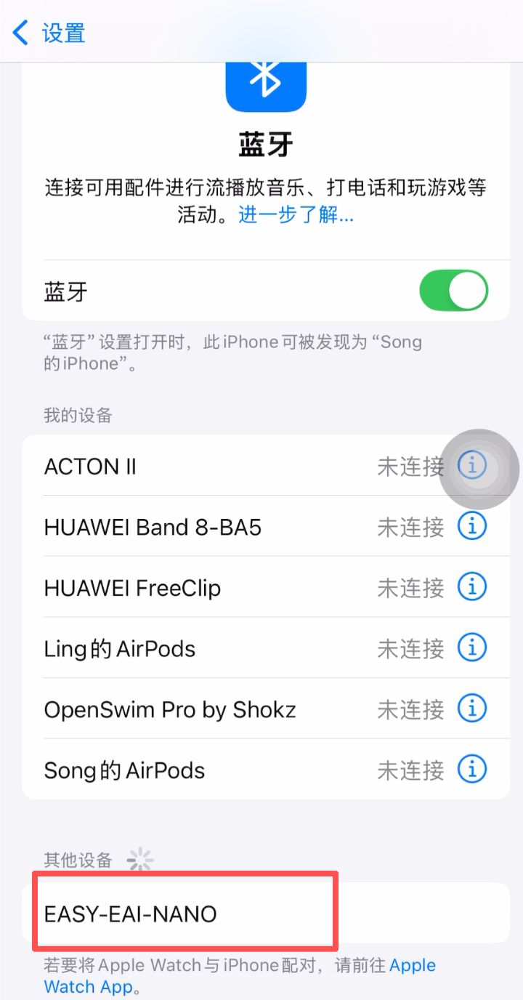
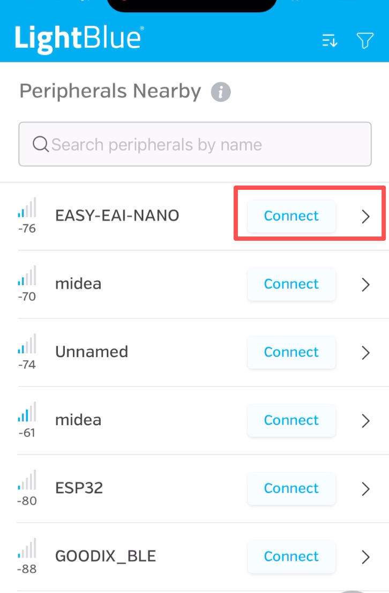
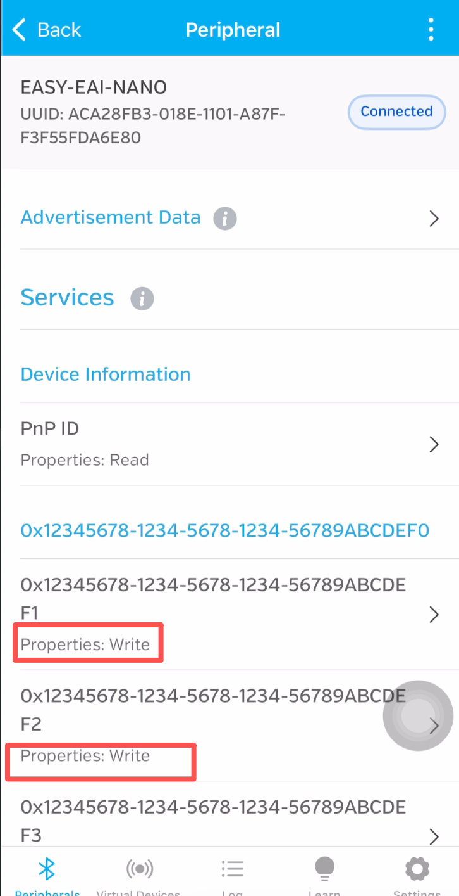
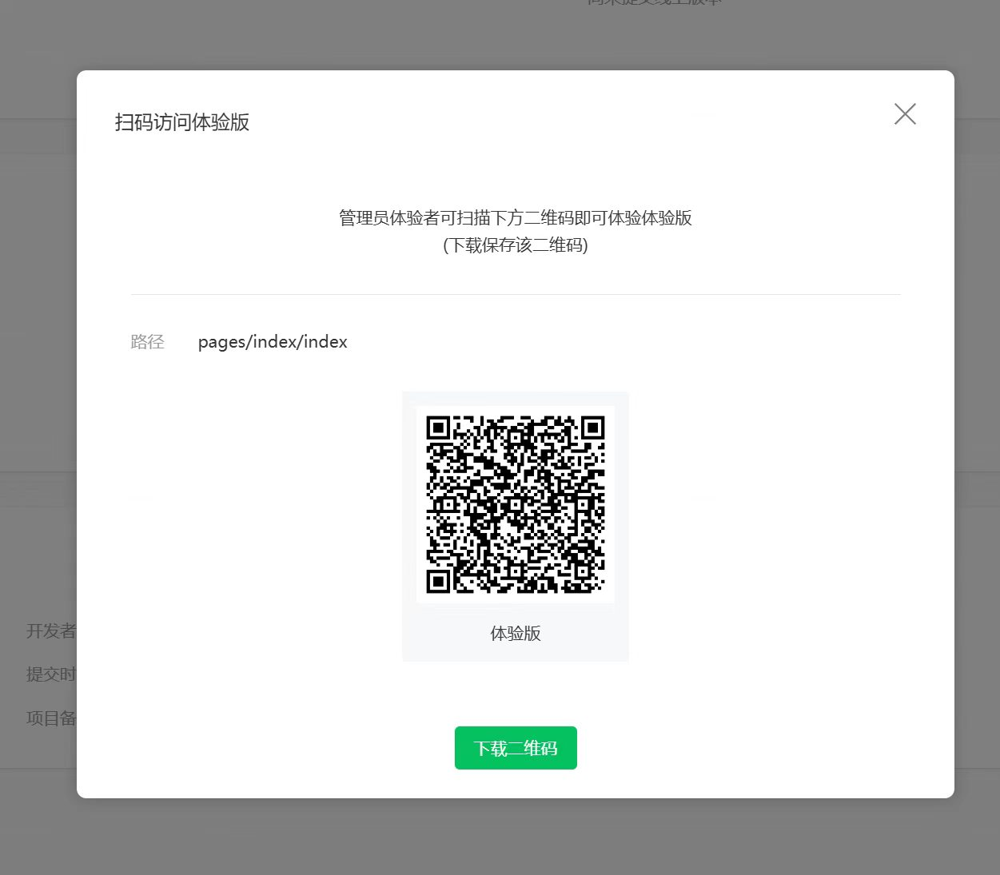
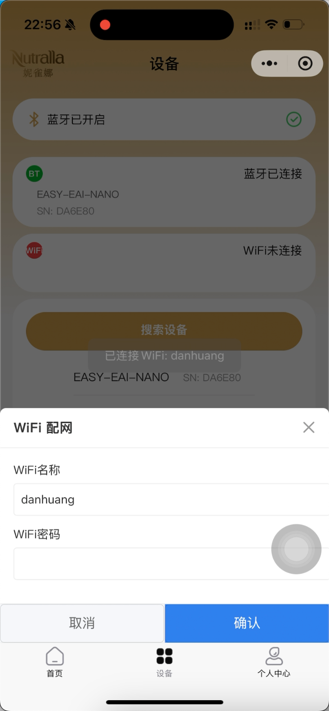

# 系统调试手册

本文说明从 **蓝牙硬件** → **板端服务** → **微信小程序** 的联调顺序。相关协议与 UUID 以仓库根目录 [`README.md`](../README.md) 中「BLE GATT 协议说明」为准。

---

## 一、蓝牙：确认模块可用

### 1.1 系统配对

在手机系统设置中完成开发板蓝牙模块的配对与连接。

更详细的 AI 板蓝牙调试说明见：[飞书文档](https://wxgytech.feishu.cn/docx/ZWetduUOVo0b5Jxo1zqcyJsdnxh)。

### 1.2 串口侧读写验证

使用串口调试类 App，对蓝牙模块做读写测试，确认链路正常。

### 1.3 与 GATT 特征对应关系

当串口侧可正常收发时，可与 GATT 特征对照理解（完整 UUID 与数据格式见 `README.md`）：

| Characteristic   | UUID 后缀 | 属性   | 功能        |
|------------------|-----------|--------|-------------|
| WiFi Config      | …def1     | Write  | WiFi 配网   |
| Cloud Config     | …def2     | Write  | 云端 URL    |
| Capture Command  | …def3     | Write  | 拍照指令    |
| Status Notify    | …def4     | Notify | 状态推送    |

**本阶段验收**：系统能稳定连接蓝牙；串口工具可验证读写；必要时对照 `README.md` 核对特征与 payload。

---

## 二、AI 板与系统服务

### 2.1 板子联网与 SSH

若板子已通过 **WiFi 自启动** 或 **有线** 接入局域网，在同一路由器/网段下查找设备内网 IP，使用 SSH 登录。

### 2.2 部署并启动服务

登录开发板后，按 [`README.md`](../README.md) 中的部署步骤安装依赖、配置 systemd，并确认 BLE 服务可正常启动（例如 `systemctl status ble-device`、查看 `journalctl` 无持续报错）。

**本阶段验收**：服务进程常驻；日志中 BLE 广播/连接行为符合预期。

### 2.3 录屏说明（参考）

以下录屏仅供流程参考；若当前硬件 WiFi 模块不可用，以实际接线与网络为准。正常情况下 **WiFi 连接成功后** 即可进入小程序联调。

- 腾讯会议录屏：<https://meeting.tencent.com/crm/NQLLaQkX1f>

---

## 三、微信小程序联调

### 3.1 打开体验版

### 3.2 设备配置与连接

在小程序内完成设备发现、蓝牙连接与网络等配置。

### 3.3 功能验证

配置成功后，在**首页**测试完整链路：**图片采集 → 上传 → 分析**（具体入口以当前小程序版本为准）。

**本阶段验收**：小程序与板端 BLE 通信正常；配网/云端地址/拍照与状态通知与 `README.md` 描述一致。

---

## 快速检查清单

| 顺序 | 检查项                         | 参考 |
|------|--------------------------------|------|
| 1    | 手机系统蓝牙可配对、连接稳定   | 本节一 |
| 2    | 串口工具可读写蓝牙模块         | 本节一 |
| 3    | 板端服务已部署且运行正常       | `README.md`、本节二 |
| 4    | 小程序可连设备并完成业务流     | 本节三 |
